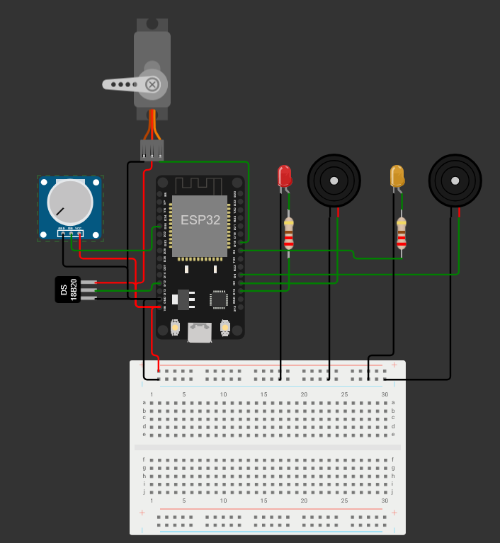

# 🥚 Proyecto: Incubadora de Huevos con Máquina de Estados (ESP32 + MicroPython)

## 🔧 Descripción general
Este proyecto implementa una **incubadora de huevos** controlada por un **ESP32** utilizando una **Máquina de Estados Finitos (MEF)**. El sistema controla:
- **Volteo de huevos**: un servo rota continuamente (0° ↔ 180°) para simular el volteo periódico.
- **Temperatura**: sensor DS18B20; si baja enciende la **lámpara** (LED amarillo), si sube demasiado enciende el **ventilador** (buzzer 1).
- **Humedad**: simulada con un **potenciómetro**; si es baja enciende el **humidificador** (buzzer 2), si es alta enciende el **ventilador**.
- **Fin de ciclo**: a los **54 segundos** se indica la **eclosión** encendiendo la **luz roja** y se detienen todos los procesos.

La MEF decide acciones según la combinación de temperatura y humedad medidas.

---

## 🛠 Componentes utilizados
- ESP32 (DevKit v1 o similar)
- Servo (SG90 o similar)
- Sensor de temperatura DS18B20 + resistencia de pull-up 4.7 kΩ
- Potenciómetro (simula humedad)
- 2 buzzers (ventilador y humidificador)
- 2 LEDs: rojo (fin de ciclo), amarillo (lámpara)
- Cables, protoboard y alimentación 5V por USB

---

## 🔌 Diagrama de conexión
- Servo (PWM, 50 Hz):
  - Señal → `GPIO18`
  - VCC → 5V (recomendable fuente separada si es posible)
  - GND → GND común
- Salidas de control:
  - Lámpara (LED amarillo) → `GPIO5`
  - Ventilador (buzzer 1) → `GPIO2`
  - Humidificador (buzzer 2) → `GPIO4`
  - Luz roja (eclosión) → `GPIO15`
- Humedad (potenciómetro):
  - Cursor → `GPIO35` (ADC 12 bits)
  - Extremos → 3V3 y GND
- Temperatura DS18B20 (OneWire):
  - Datos → `GPIO12` (con resistencia 4.7 kΩ a 3V3)
  - VCC → 3V3
  - GND → GND

> Importante: comparte GND entre todas las fuentes. El servo puede requerir fuente separada para evitar resets del ESP32.

---

## 📲 Funcionamiento
- El sistema arranca en estado Q0 y mantiene el servo alternando cada 1 s (volteo) mientras no haya fin de ciclo.
- Cada ciclo lee:
  - **Humedad** (potenciómetro): clasifica H = 0 (baja), 1 (media), 2 (alta).
  - **Temperatura** (DS18B20): clasifica T = 0 (baja < 36°C), 1 (ideal 36–39°C), 2 (alta > 39°C).
- Con `(T, H)` se calcula una fila de la tabla de transición/salida y se ejecuta la acción:
  - S1 lámpara ON si T baja
  - S2 ventilador ON si T alta o H alta
  - S3 humidificador ON si H baja
  - S0 sin acción si condiciones ideales
- A los **54 s** se activa S5 (luz roja encendida) y se detiene cualquier otra acción.

  #video

---

## 🧩 Explicación del código
- Estados (Q0–Q3) y salidas (S0–S5) definidos con tablas `tablaTran` y `tablaSalida` que representan la MEF.
- Lecturas:
  - Potenciómetro en `GPIO35` con promedio de 5 muestras para una lectura estable.
  - DS18B20 en `GPIO12` con `convert_temp()` y retardo de 750 ms antes de `read_temp()`.
- Lógica de control:
  - `lectura_entradas()` retorna la fila de tablas según T y H, o fuerza fila 10 cuando pasa el tiempo de eclosión (54 s).
  - `escritura_salidas()` apaga todas las salidas y enciende solo la correspondiente a la salida Sx.
  - El servo alterna 0°/180° cada 1 s mientras no sea fin de ciclo.
- Bucle principal: ejecuta lectura → salida → transición de estado cada 0.5 s.

---

## ▶️ Cómo usar
1. Flashea MicroPython en tu ESP32 (por ejemplo con Thonny).
2. Conecta el circuito según el diagrama.
3. Copia `main.py` y las librerías `onewire.py` y `ds18x20.py` si tu firmware no las trae.
4. Alimenta el servo correctamente; si usas fuente externa, comparte GND con el ESP32.
5. Ejecuta `main.py` y observa en consola el estado, T, H y acciones.

---

## ✅ Conclusión
La incubadora implementa control por **MEF** combinando sensores analógicos y digitales, actuadores y temporización para simular un ciclo de incubación con volteo, control térmico y de humedad, finalizando con señalización de **eclosión** a los 54 s.

## 👥 Integrantes
- Flores, Javier Alejandro
- Luna Perez, Elio Orlando
- Ruiz, Fernando
