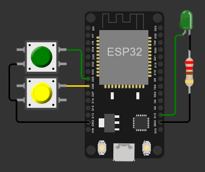
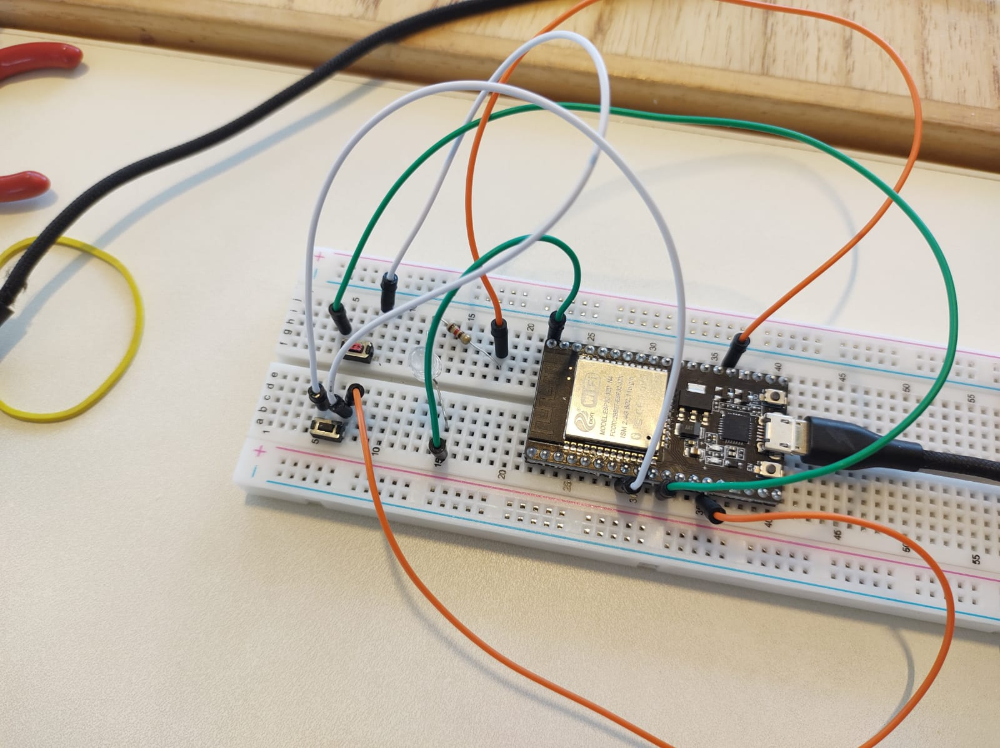

# 🔐 Proyecto: Cerradura con Contraseña Binaria (2 Botones) – ESP32 + MicroPython

## 🔧 Descripción general
Este proyecto implementa una cerradura digital simple en **ESP32** utilizando **dos botones** para ingresar una **contraseña de 4 bits**. Cada pulsación agrega un bit al registro:
- Botón 1 → Bit "1"
- Botón 2 → Bit "0"

Al completar 4 bits, el sistema compara el registro con una clave predefinida (`1010`). Si coincide, se activa la salida de apertura (simulada con un **LED en GPIO15**). Si no coincide, muestra un mensaje de error y mantiene el LED apagado. Incluye antirrebote por software.

---

## 🛠 Componentes utilizados
- ESP32 (DevKit v1 o similar)
- 2 botones pulsadores
- 1 LED (indicador de apertura)
- 1 resistencia para LED (220–330 Ω)
- Cables y protoboard
- Alimentación por USB (5V)

> Opcional: un relé o servo para accionar una puerta real (en el proyecto se simula con un LED).

---

## 🔌 Diagrama de conexión
- Botones (con `Pin.PULL_UP`, activos en 0):
  - Botón 1 (bit 1) → `GPIO25`
  - Botón 2 (bit 0) → `GPIO26`
- LED de apertura:
  - Señal → `GPIO15`
  - Conectar el LED con su resistencia en serie a GND (modo activo-alto)

---

## 📲 Funcionamiento
- El usuario ingresa una secuencia de 4 bits presionando los botones (1 o 0).
- Cada pulsación guarda el bit y avanza la posición del registro.
- Al completar 4 bits, se compara con la contraseña predefinida (`1010`).
  - Si coincide → «Apertura»: LED enciende.
  - Si no coincide → «Error»: LED apaga.
- El registro se reinicia para permitir un nuevo intento.

  https://github.com/user-attachments/assets/5d306bf0-ebf4-4e72-b3ee-aa09fc11f9ad

---

## 🧩 Explicación del código
- Importaciones: `machine.Pin`, `time.sleep`.
- Definición de pines:
  - `led = Pin(15, Pin.OUT)`
  - `boton1 = Pin(25, Pin.IN, Pin.PULL_UP)`  → representa bit 1
  - `boton2 = Pin(26, Pin.IN, Pin.PULL_UP)`  → representa bit 0
- Variables de estado:
  - `registro = [0, 0, 0, 0]` y `posicion = 0`
  - `comparar = [1, 0, 1, 0]`  (clave: 1010)
- Antirrebote: `sleep(0.3)` tras cada pulsación.
- Lógica principal:
  - Si `boton1.value() == 0` → agrega 1 al registro.
  - Si `boton2.value() == 0` → agrega 0 al registro.
  - Cuando `posicion >= 4`, compara con `comparar`:
    - Coincide → enciende LED (`led.value(1)`).
    - No coincide → apaga LED (`led.value(0)`).
  - Reinicia `registro` y `posicion` para el próximo intento.

---

## ▶️ Cómo usar
1. Flashea MicroPython en tu ESP32 (por ejemplo con Thonny).
2. Conecta el circuito según el diagrama.
3. Copia `main.py` a la raíz del ESP32.
4. Abre el monitor serie para ver los mensajes (ingreso de bits, resultado de la comparación).
5. Ingresa 4 bits con los botones. La clave por defecto es `1010`.

---

## ✅ Conclusión
Un ejercicio práctico para combinar entradas digitales con `PULL_UP`, manejo de estados y validación de contraseñas en **MicroPython**. Fácil de extender para más bits, distintas claves o salida real mediante relé/servo.

## 👥 Integrantes
- Pintos, Miguel Hugo
- Santucho, Juliana de los Angeles
- dos Santos, Eduardo Enrique
